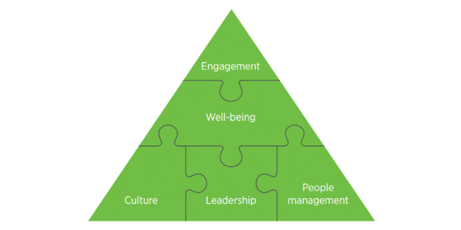

Employee engagement has become top managers’ main point of consideration as an indicator of organisational health, informing people-related decisions both on the strategic and operational business levels. Being quite a sophisticated construct, Managers and HR Practitioners suffer to manage the engagement in their teams as there is no common understanding of its definition. In this post we will give the definition to the employee engagement, so to further understand its drivers and ways how to apply people management practices while leveraging those drivers.

Imagine, you are a doctor healing its patients. When a sick person enters your office, you will first ask questions to reveal the symptoms, then measure a temperature, as well as assign additional tests to make a diagnosis and finally prescribe a treatment. In other words, you will follow certain protocols or methodology. Likewise, employee engagement is a methodology helping managers to keep their teams healthy.   

A healthy workplace is something that can be described by the [CIPD Wellbeing Pyramid Model](https://www.cipd.ie/news-resources/practical-guidance/guides/well-being-work). 

According to this pyramid, in order to build a healthy workplace, an employer must ensure that its culture, leadership and people management become a foundation for building the integrated wellbeing approach. It means that when people feel a high level of wellbeing, they are more engaged and productive at work. But what does engagement mean? 

There’s no common understanding of employee engagement among the HR community or scientists. In 2009 David MacLeod found over 50 definitions of engagement. One of the earliest is Kahn’s which focuses on internal state of being, such as discretionary effort or ‘going the extra mile’, that was closely related to behaviour. Some later definitions are closer to job satisfaction. These relate to a number of aspects of organisational life and are typically used by consultancies. For example, Gallup’s Q12 questionnaire covering job clarity, job resources, recognition, etc. But these measures may cause confusion, as it becomes difficult to distinguish engagement from the other concepts.

Due to lack of consensus in what the engagement is, it was heard to measure it and give advice on how to achieve it. Therefore, [the research](https://www.cipd.co.uk/knowledge/fundamentals/relations/engagement/factsheet#gref) of existing literature related to this topic was held. It revealed the approach to label the engagement in two ways:

1. Employee Engagement. It describes a broad subject area or umbrella term that includes work engagement and other more specific terms, such as organisational engagement, motivation and organisational commitment.

2. Work Engagement. It describes the state of vigour, dedication and absorption. It is the most common construct and measure in scientific research and gives the strongest evidence base.

Both terms refer to a psychological or physical state of being. 

For the purpose of clarity, these engagement terms are not used to describe: 
* management activity - which we see as a factor that affects employee engagement,
* job satisfaction - which may either contribute to or result from employee engagement,
* job quality - which describes criteria of a “good work” when employees are fairly rewarded, have means to securely make a living, opportunities to develop skills and a career, etc.,
* employee behaviour.

Now, when we are clear on the engagement definition, you might be curious to look closely on the [engagement drivers](https://gracefulhr.com/post/engagement-drivers/) and [engagement measurements](https://gracefulhr.com/post/measuring-engagement/).
